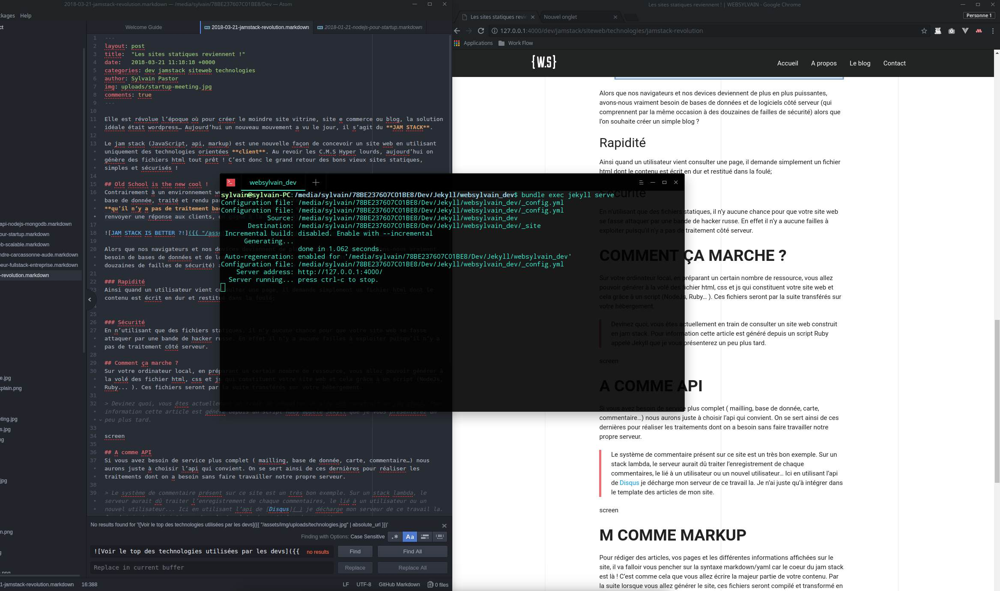

Elle est révolue l’époque où, pour créer le moindre site vitrine, e-commerce ou blog, la solution idéale était WordPress… Aujourd’hui, un nouveau mouvement a vu le jour : le **JAMstack**.

Le JAMstack (JavaScript, APIs, Markup) est une approche moderne qui consiste à concevoir des sites web en s’appuyant exclusivement sur des technologies orientées **client**. Exit les CMS lourds et complexes : le JAMstack privilégie la génération de fichiers HTML statiques, offrant ainsi simplicité et sécurité. C’est donc le grand retour des sites statiques, mais remis au goût du jour !

## Old School is the New Cool !
Contrairement à un environnement web classique où chaque requête implique l’interrogation d’une base de données, son traitement, puis son rendu à l'utilisateur, le **JAMstack** repose sur le principe **qu’il n’y a aucun traitement backend** à effectuer lors de l'affichage d'une page. En supprimant ces étapes, on gagne en rapidité, en simplicité et en sécurité.

### Rapidité

Avec des navigateurs et des appareils toujours plus performants, avons-nous vraiment besoin d’utiliser des bases de données et des logiciels côté serveur (qui peuvent comporter des failles de sécurité) pour un simple blog ? Avec le JAMstack, lorsque l’utilisateur consulte une page, il obtient simplement un fichier HTML, dont le contenu est déjà pré-généré et prêt à être affiché instantanément.

### Sécurité
En n’utilisant que des fichiers statiques, les risques de piratage sont grandement réduits. Sans serveur pour traiter les requêtes, il n’y a aucune surface d’attaque côté backend. Aucune faille côté serveur ne peut être exploitée, car il n’y a pas de serveur à pirater !

## Comment ça marche ?
Le processus de création d’un site en JAMstack se déroule en local. À partir de ressources spécifiques, vous générez des fichiers HTML, CSS et JavaScript à l'aide d’un script (Node.js, Ruby, etc.). Ces fichiers sont ensuite déployés sur votre serveur d'hébergement.

> Devinez quoi, vous êtes actuellement en train de consulter un site construit en JAMstack. Pour information, celui-ci est généré grâce à une gem Ruby appelée **Jekyll**.

## A comme API
Pour ajouter des services plus avancés (mailing, bases de données, cartes, commentaires, etc.), vous pouvez vous appuyer sur des **APIs**. Plutôt que de surcharger votre serveur avec ces tâches, vous déléguez ces traitements aux APIs appropriées.

> Un bon exemple est le système de commentaires présent sur ce site. Sur un stack classique, le serveur aurait dû traiter chaque commentaire, le relier à un utilisateur, gérer la base de données, etc. Ici, grâce à l'API de [Disqus](https://disqus.com/), je décharge mon serveur de ce travail. Il suffit d’intégrer l’API dans le template des articles.

## M comme Markup
Pour rédiger vos articles, pages et contenus, vous utiliserez des syntaxes comme **Markdown** ou **YAML**. Ce sont des langages de balisage simples qui constituent le cœur du JAMstack. Une fois vos contenus rédigés, ils sont compilés pour être transformés en HTML.

## Les limites du JAMstack
Le JAMstack atteint ses limites lorsqu’il s’agit de déployer des plateformes complexes ou des sites avec des services innovants. Cependant, pour la création de sites centrés sur le contenu, cette méthode est idéale. Si votre principal objectif est de mettre en avant du contenu de manière efficace et sécurisée, le JAMstack est une solution à envisager.

---

Sources : [jamstack.com](http://jamstack.com), [jamstatic.fr](http://jamstatic.fr)
