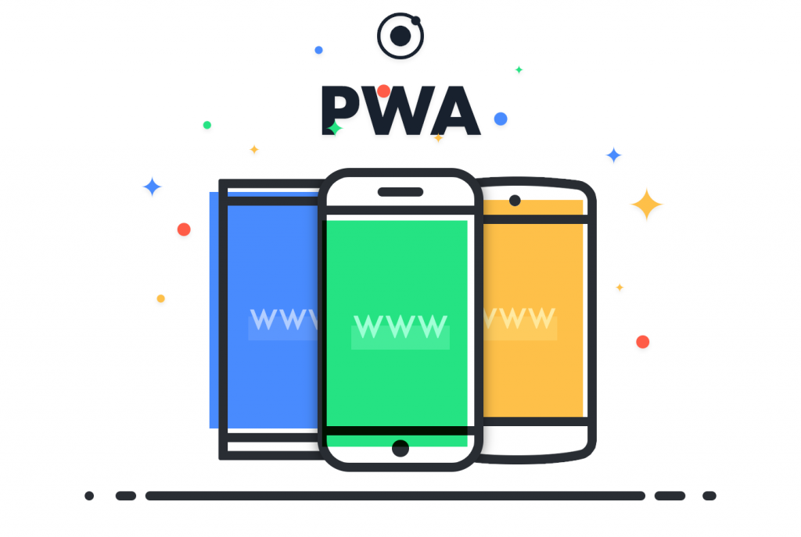

Le constat actuel du marché mobile est le suivant : d'un côté, nous avons les applications natives codées directement pour Android, iOS, PC... et de l'autre, les applications hybrides, qui convertissent du code HTML en natif. FACE à l’évolution des navigateurs et des habitudes d’utilisation, Google nous propose un nouveau concept bien plus performant : les **Progressive Web Apps** (PWA).

## Qu'est-ce qu'une Progressive Web App ?

Le terme **Progressive Web App** a été introduit par Alex Russell, développeur Chrome. Une PWA est un site web qui s’adapte aux différents terminaux et technologies. Plus qu’un simple site responsive, ces applications s’adaptent également à la force du signal Wi-Fi, 3G, 4G, ou 5G…

L'objectif est de proposer une expérience d’application native directement à travers le navigateur de votre smartphone ou tablette.

## Avantages des applications natives et du web

Contrairement à votre site web, l’application native de votre concurrent a plusieurs avantages :

* **Icône visible** sur l’écran d’accueil qui incite à l'utilisation.
* **Notifications** pour ramener l’utilisateur vers l’application.
* Accessibilité hors ligne.

> Ainsi, les applications natives rappellent à l’utilisateur de les utiliser, tandis que votre site web est souvent caché derrière l’icône du navigateur.

### Les inconvénients des applications natives/hybrides

Le principal inconvénient réside dans la diminution du nombre d’utilisateurs tout au long du parcours pour obtenir l’application.

Source : [Article Medium de Dan Dascalescu](https://medium.com/dev-channel/why-progressive-web-apps-vs-native-is-the-wrong-question-to-ask-fb8555addcbb)

### PWA : Combinaison des avantages du web et des applications mobiles

Un site web offre de nombreux avantages par rapport à une application, notamment en termes de portée et d'engagement des utilisateurs. Imaginez maintenant qu’un site ouvert sur smartphone possède les avantages d’une application mobile :

> Votre site sera rapide, l’utilisateur pourra l’ajouter facilement à son écran d’accueil et recevoir des notifications (actualités, messages...) pour l'inciter à revenir.

Lorsque l'utilisateur est hors ligne (pas de réseau Wi-Fi, 3G, 4G...), votre PWA **ne vous affichera pas le dinosaure** redouté de Google. La navigation reste possible avec les contenus déjà chargés, grâce à un système de cache intelligent qui enregistre les données importantes.

## Dans la pratique

ATTENTION, "Progressive Web Apps" est un terme marketing. **Ce n'est pas un nouveau canal de distribution.** C’est simplement votre site web mobile auquel on ajoute les fonctionnalités souhaitées (rapidité, ajout à l’accueil, notifications...).

La logique *progressive* est la suivante : plus un mobinaute a de possibilités d'usage (via la technologie embarquée sur son appareil, l’état du réseau...), plus le site web déploie ses ailes !

### Exemples de Progressive Web Apps

Voici l’exemple de l’application “Pokémon” de Google, qui montre l’ajout d’un site web progressif à l’écran d’accueil.

Source : [developers.google.com](https://developers.google.com/web/updates/2015/12/getting-started-pwa)

1. Accédez au site via le navigateur.
2. Cliquez sur le bouton “Ajouter à l’écran d’accueil”, une action qui prend environ 1 seconde.
3. En cliquant sur l’icône, vous obtenez un “Splash screen” qui occupe l’écran pendant le chargement du site.
4. Le site s’affiche sans l’entête du navigateur. **L’illusion est faite : votre site passe pour une vraie application ! :D**

## L'exemple concret d'AliExpress

AliExpress, un site de commerce en ligne du groupe Alibaba, a choisi d'opter pour les PWA pour faire évoluer son business. Voici une petite vidéo qui présente la nouvelle version de son site web :

Lors de votre visite, une bannière vous propose d’ajouter leur site à l’écran d’accueil de votre smartphone, vous permettant ainsi de recevoir des notifications concernant votre compte. De plus, lorsque vous retournez sur le site depuis l’icône, il n'y a ni en-tête ni pied de page du navigateur visible. L'illusion est parfaite !

<iframe width="100%" height="315" src="https://www.youtube.com/embed/lzQhw_wbr7c" frameborder="0" allowfullscreen></iframe>

## Des règles à respecter !

Pour être qualifiée de PWA, une application doit respecter certaines règles :

- **Progressive & Responsive** : s’adapte à la taille de l’écran et aux technologies embarquées.
- **Connectivity independent** : si le smartphone n'est pas connecté, les contenus consultés lors d'une précédente visite restent accessibles.
- **Easily installable** : installation simplifiée par un clic pour l’ajouter à l’écran d’accueil.
- **App-like** : cohérence graphique avec les applications mobiles.
- **Safe** : doit fonctionner sur HTTPS pour garantir la sécurité.
- **Fresh** : toujours à jour.
- **Linkable & discoverable** : possibilité d’accéder à une des pages de l’app via un simple lien.
- **Benefit From Native Features** : notifications, widgets sur smartphone...
- **Manifest** : un document à la racine du site permettant à Google et au navigateur de comprendre qu’il s’agit d’une web app.

## Impact sur le business

L'intérêt principal est la rentabilité apportée par une telle technologie. Voici quelques statistiques provenant d'AliExpress et des données fournies par Google :

* 2x plus de pages consultées
* Augmentation de 74 % du temps passé sur le site
* 104 % de conversions supplémentaires

> Alors, convaincu par les Progressive Web Apps ?
